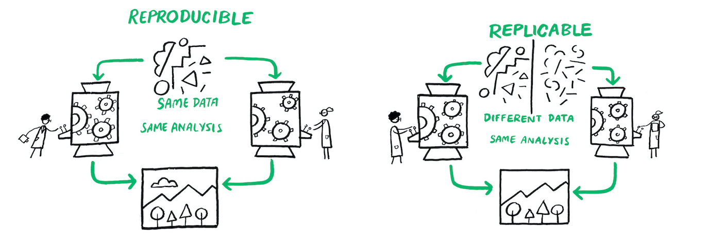

```{r setup, include=FALSE}
options(htmltools.dir.version = FALSE)
```


```{r xaringan-themer, include=FALSE, warning=FALSE}
library(xaringanthemer)
library(xaringanExtra)
library(tidyverse)
library(knitr)
xaringanExtra::use_panelset()
xaringanExtra::use_broadcast()
xaringanExtra::use_share_again()
xaringanExtra::style_share_again(share_buttons = c("twitter", "linkedin"))
xaringanExtra::use_tachyons()
xaringanExtra::use_fit_screen()
xaringanExtra::use_tile_view() # O
style_mono_accent(
  base_color = "#56BCD3",
  background_color = "#ffffff",
  inverse_background_color = "#56BCD3",
  header_color = "#56BCD3",
  inverse_header_color = "#ffffff", 
  inverse_text_color = "#ffffff",
  code_inline_color = "#56BCD3",
  link_color= "#56BCD3",
  footnote_color =  "#56BCD3",
  text_font_size = "35px",
  header_font_google = google_font("Times", "Regular", "500"),
  text_font_google   = google_font("Darker Grotesque", "500"),
  code_font_google   = google_font("Fira Mono")
)


require(kableExtra,quietly=TRUE)
require(tidyverse,quietly=TRUE)
require(lubridate,quietly=TRUE)
require(plotly,quietly=TRUE)

set.seed(11010)
```

<style>
.center-middle {
  display: flex;
  justify-content: center;
  align-items: center;
  height: 100vh;
  text-align: center;
  font-weight: bold;
}
</style>

---


class: center, middle, inverse
background-image: url("figs/hca.jpg")
background-position: center
background-size: cover

# Haciendo Ciencia Abierta


## Clase 1
### Ignacio Sarmiento-Barbieri
---

class: middle

### Agenda 

- Motivación 

- Ética 

- Problemas
  
- Soluciones
  

---
# Motivacion

- Confiabilidad en la evidencia 

  - Fraude
  
  - Incapacidad de Reproducir Resultados

---
background-image: url(figs/forbes_gino.png) 
background-position: center
background-size:  600px


## 

---


## 

<div style="font-size: 30px; text-align: center;">
<table>
<thead>
<tr>
<th>Estudio</th>
<th>Número de artículos (solicitudes)</th>
<th>Reproducción intentada</th>
<th>Reproducción exitosa</th>
<th>Tasa de reproducción</th>
<th>Tasa de reproducción por artículo empírico</th>
</tr>
</thead>
<tbody>
<tr>
<td>Dewald et al (1986) antes del cambio de política</td>
<td>62</td>
<td>5</td>
<td>3</td>
<td>60.0%</td>
<td>4.8%</td>
</tr>
<tr>
<td>Dewald et al (1986) después del cambio de política</td>
<td>92</td>
<td>3</td>
<td>2</td>
<td>66.7%</td>
<td>2.2%</td>
</tr>
<tr>
<td>McCullough and Vinod (2003)</td>
<td>193</td>
<td>62</td>
<td>14</td>
<td>22.6%</td>
<td>7.3%</td>
</tr>
<tr>
<td>Chang and Li (2015)</td>
<td>67</td>
<td>59</td>
<td>29</td>
<td>49.2%</td>
<td>43.3%</td>
</tr>
</tbody>
</table>
</div>


---
# Normas para la investigación ética

- Normas Mertonianas (Merton 1942)

  - Universalismo
  
  - Comunalismo
  
  - Desinterés
  
  - Escepticismo Organizado


---
class: center, middle


**Universalismo **

El conocimiento científico debe ser juzgado únicamente por su validez y mérito intrínseco, independientemente de la nacionalidad, género, religión, posición social o cualquier otra característica personal del científico.


---
class: center, middle


**Comunalismo** 

los resultados del trabajo científico deben ser compartidos libremente con la comunidad científica y con la sociedad en general.

---
class: center, middle


**Desinterés** 

Los investigadores deben actuar con imparcialidad y objetividad, buscando el conocimiento por el bien común y no por beneficios personales o intereses privados. 


---
class: center, middle


**Escepticismo Organizado** 

Adoptar una actitud crítica y cuestionadora hacia las afirmaciones y teorías científicas, incluidas las propias.

---
# Normas en la práctica
[(Anderson et al 2007)](http://www.jstor.org/stable/pdf/10.1525/jer.2007.2.4.3.pdf)  

- Universalismo - Particularismo

- Comunalismo - Secretismo

- Desinterés - Interés

- Escepticismo Organizado - Dogmatismo Organizado

- Gobernanza - Administración

- Calidad - Cantidad
---
background-image: url(figs/AMdV2007_1.PNG)
background-position: center
background-size:  800px


---
background-image: url(figs/AMdV2007_2.PNG)
background-position: center
background-size:  800px


---
background-image: url(figs/AMdV2007.PNG)
background-position: center
background-size:  800px


---
# Problemas

- Sesgo de publicación

- Búsqueda de especificaciones

---
background-image: url(figs/sig_1.png)
background-position: center
background-size:  250px


---
background-image: url(figs/sig_2.png)
background-position: center
background-size:  250px

---
background-image: url(figs/sig_3.png)
background-position: center
background-size:  250px

---
class: center, middle, inverse
background-position: center

# 16 doritos mas tarde


---
background-image: url(figs/sig_20.png)
background-position: center
background-size:  250px

---
background-image: url(figs/sig_final.png)
background-position: center
background-size:  500px


---
### Modelo conceptual para aproximar estos problemas
#### Revisión tipos de error


<div style="font-size: 35px; text-align: center;">
<table>
    <tr>
      <th>Decisión sobre H0</th>
      <th>La hipótesis nula (H0) es verdadera</th>
      <th>La hipótesis nula (H0) es falsa</th>
    </tr>
    <tr>
      <td>No rechazar H0</td>
      <td>Inferencia correcta (verdadero negativo)<br></td>
      <td><span style="color: violet;">Error de Tipo II (falso negativo)</span></td>
    </tr>
    <tr>
      <td>Rechazar H0</td>
        <td><span style="color: red;">Error de Tipo I (falso positivo)</span></td>
      <td>Inferencia correcta (verdadero positivo)</td>
    </tr>
  </table>
</div>

---
### Modelo conceptual para aproximar estos problemas


- Ioannidis (2005)  *"Why Most Published Research Findings Are False"*. 

- Proporciona un marco teórico para entender por qué una gran proporción de los hallazgos científicos pueden ser falsos positivos.

- Fundamenta en la estadística bayesiana y en varias consideraciones prácticas del proceso de investigación.


---
### Modelo conceptual para aproximar estos problemas
#### Valor predictivo positivo (*positive predictive value o PPV*)

$$
PPV = Pr(V | S)
$$

$$ P(V | S) = \frac{P(S | V) \cdot P(V)}{P(S)} $$


---
### Modelo conceptual para aproximar estos problemas
#### Valor predictivo positivo (*positive predictive value o PPV*)

$$ P(V | S) = \frac{P(S | V) \cdot P(V)}{P(S)} $$

$$
P(V) = \frac{R}{R+1}
$$

- $R$ como la relación entre el número de “relaciones verdaderas” y “ninguna relación”

$$
P(S | V) = 1 - \beta
$$
$$
P(S | F) = \alpha
$$


---
### Modelo conceptual para aproximar estos problemas
#### Valor predictivo positivo (*positive predictive value o PPV*)

$$ P(V | S) = \frac{P(S | V) \cdot P(V)}{P(S)} $$

$$
P(V) = \frac{R}{R+1}
$$

- $R$ como la relación entre el número de “relaciones verdaderas” y “ninguna relación”

$$
P(S | V) = 1 - \beta
$$
$$
P(S | F) = \alpha
$$

---
### Modelo conceptual para aproximar estos problemas
#### Valor predictivo positivo (*positive predictive value o PPV*)

$$ PPV =  P(V | S) = \frac{(1 - \beta) \cdot R}{(1 - \beta) \cdot R + \alpha } $$
---
### Modelo conceptual para aproximar estos problemas
#### Valor predictivo positivo (*positive predictive value o PPV*)

- Incorporamos $u$ sesgo del investigador

$$
PPV= \frac{(1 - \beta) \cdot R + u \beta R}{(1 - \beta) \cdot R + \alpha + u\beta R + u(1- \alpha)} 
$$


---
background-image: url(figs/ioannidis.png)
background-position: center
background-size:  650px


---
### Evidencia del problema

- Sesgos de publicación

- Búsqueda de especificaciones

---
background-image: url(figs/Mervis.png)
background-position: center
background-size:  500px

---
background-image: url(figs/GerberSoc.PNG), url(figs/GerberPS.PNG)
background-size: 450px, 600px
background-position: 10% 70%, 90% 70%  


---
# Soluciones: Promoviendo Ciencia Transparente 

* La investigación puede tener sesgos individuales y en la literatura.

* El meta-análisis y las revisiones de la literatura tienen limitaciones.

* Los registros de estudios y planes de análisis previos (PAPs) pueden ayudar a mitigar los sesgos.

---
## Registros de estudios

* Los registros de estudios ayudan a encontrar investigaciones y lidiar con el sesgo de publicación.

* La prescripción de estudios es crucial para la transparencia.

* Los registros son la norma en la investigación médica para experimentos aleatorios.

* Los registros a menudo incluyen (o enlazan a) planes de análisis previos  (PAP) como parte del protocolo del proyecto. 

---
background-image: url(figs/turner.jpg)
background-position: center
background-size:  350px

---
## Planes de análisis previos (PAPs)

### Tres Objetivos: 

  - Establecer (y acordar) intenciones y expectativas ex ante
     
  - Evitar malos análisis de datos ex-post
     
  - Mejorar diseños


---
## Planes de análisis previos (PAPs)

###  *¿Qué incluir en un PAP?*

* Diseño del estudio
* Muestra del estudio
* Medidas de resultado
* Familias de efectos
* Ajuste de pruebas de hipótesis múltiples
* Subgrupos
* Dirección del efecto
* Especificación estadística exacta
* Modelo estructural
* ¡Sello que registre cuando fue publicado!


---
## Planes de análisis previos (PAPs)

### Establecer intenciones y expectativas ex-ante

 - Un hallazgo de efecto heterogéneo es más creíble cuando se especifica previamente
     
 - Las afirmaciones de que los resultados son "sorprendentes" son más creíbles cuando el PAP documenta la expectativa opuesta
     
 - A veces, los miembros del equipo y los socios no están de acuerdo sobre lo que ''quisimos hacer todo el tiempo'': los PAP son un buen lugar para resolver eso de antemano.
     

---
## Planes de análisis previos (PAPs)

### Evitar malos análisis  de datos ex-post

  - p-hacking
    
  - Cambio de variables de resultados
    
  - Análisis de subgrupos por conveniencia

---
## Planes de análisis previos (PAPs)

### Los PAP no son contratos inquebrantables

    ... eso es probablemente algo bueno

   - ¡La gente prerregistra malos análisis!
     
   - Aprendemos sobre nuevos / mejores análisis
  
   -  Los revisores tendrán su opinión

        ... con lamentables consecuencias

  - Incluso con los PAP, la gente hace sus malos análisis ex-post todo el tiempo     

---
## Planes de análisis previos (PAPs)

### El objetivo principal: mejorar los diseños.

  - El momento de escribir un plan de preanálisis suele ser la primera vez que pensamos en el diseño en su totalidad.
  
  - Hacer el cambio de "buena idea" a "diseño real" significa ser específico
  
  - Este es el momento de participar en la declaración de diseño


---
## Planes de análisis previos (PAPs)
####  Reportes Registrados


- son un formato de publicación que enfatiza la importancia de la pregunta de investigación y la calidad de la metodología.

- Los autores primero escriben un protocolo de estudio detallado en el PAP 

- luego lo envían a una revista antes que el experimento inicie o se recolecten los datos. La revista revisa el plan y da una aceptación en principio o no.

---
background-image: url(figs/registered.png)
background-position: center
background-size:  500p


---
## Soluciones: Reproducibilidad y Transparencia  en los procesos analíticos


- La reproducibilidad en la investigación se refiere a la capacidad de otros investigadores para obtener resultados similares o idénticos al repetir un estudio utilizando la misma metodología y datos.

- Es un principio fundamental para garantizar la confiabilidad y validez de la ciencia, y juega un papel crucial en la promoción de la transparencia.

---
## Soluciones: Reproducibilidad y Transparencia  en los procesos analíticos

```{r REPRO, echo = FALSE, out.width=900, fig.align='center'}

```


---
## Soluciones: Reproducibilidad y Transparencia  en los procesos analíticos


- Permite el escrutinio público y la detección de errores

- Facilita la evaluación crítica de la investigación

- Promueve la colaboración y el intercambio de conocimiento

-  Combate el sesgo de publicación y búsqueda de especificaciones

- Aumenta la confianza en la ciencia y la credibilidad de los investigadores

---
## Soluciones: Reproducibilidad y Transparencia  en los procesos analíticos

### Plan para el miércoles

- Flujos de trabajo reproducible

- Examinaremos Mirza et al (2021) [Global inequality remotely sensed](https://www.pnas.org/doi/full/10.1073/pnas.1919913118)

---

class: center, middle, inverse
background-image: url("figs/hca.jpg")
background-position: center
background-size: cover

# Haciendo Ciencia Abierta


## Gracias!!!
### Ignacio Sarmiento-Barbieri

