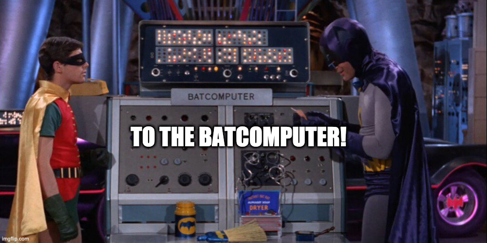
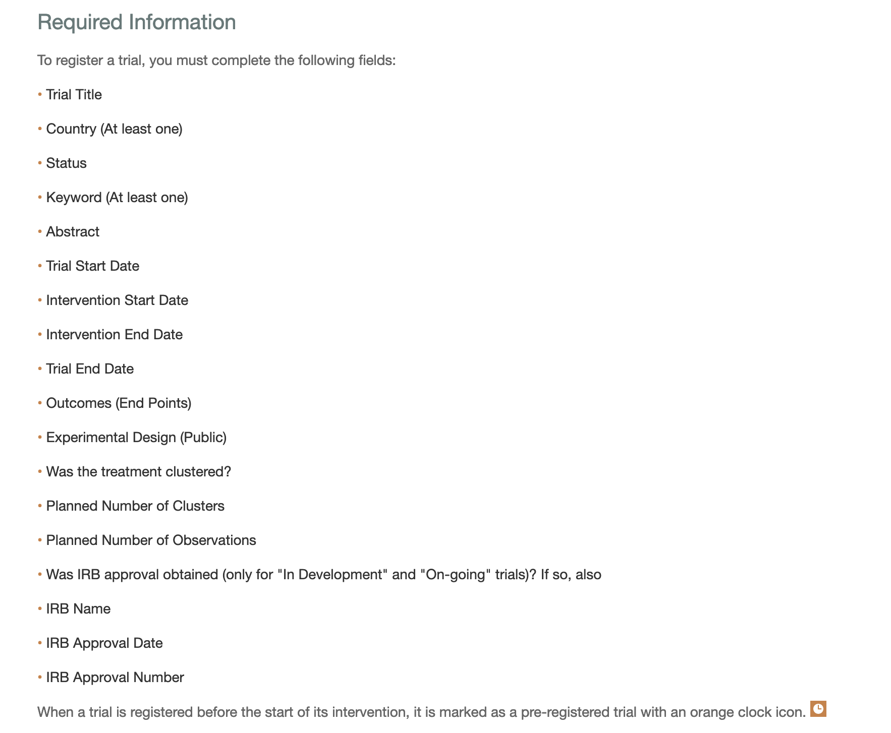

```{r xaringan-themer, include=FALSE, warning=FALSE}
library(xaringanthemer)
library(xaringanExtra)
library(tidyverse)
library(knitr)

# Define pink color
red_pink <- "#e64173"
turquoise <- "#20B2AA"
orange <- "#FFA500"
red <- "#fb6107"
blue <- "#3b3b9a"
green <- "#8bb174"
grey_light <- "grey70"
grey_mid <- "grey50"
grey_dark <- "grey20"
purple <- "#6A5ACD"
slate <- "#314f4f"

xaringanExtra::use_panelset()
xaringanExtra::use_broadcast()
xaringanExtra::use_share_again()
xaringanExtra::style_share_again(share_buttons = c("twitter", "linkedin"))
xaringanExtra::use_tachyons()
xaringanExtra::use_fit_screen()
xaringanExtra::use_tile_view() # O
style_mono_accent(
  base_color = "#56BCD3",
  background_color = "#ffffff",
  inverse_background_color = "#56BCD3",
  header_color = "#56BCD3",
  inverse_header_color = "#ffffff", 
  inverse_text_color = "#ffffff",
  code_inline_color = "#56BCD3",
  link_color= "#56BCD3",
  footnote_color =  "#56BCD3",
  text_font_size = "35px",
  header_font_google = google_font("Times", "Regular", "500"),
  text_font_google   = google_font("Darker Grotesque", "500"),
  code_font_google   = google_font("Fira Mono")
)


require(kableExtra,quietly=TRUE)
require(tidyverse,quietly=TRUE)
require(lubridate,quietly=TRUE)
require(plotly,quietly=TRUE)
require(scales,quietly=TRUE)
require(DeclareDesign)
set.seed(11010)
```


class: center, middle, inverse
background-image: url("figs/hca.jpg")
background-position: center
background-size: cover

# Haciendo Ciencia Abierta


## Dia 2
### Ignacio Sarmiento-Barbieri
---

class: middle

### Agenda 

- Hoy: 
  
  - Control de Versión: `Git` and `Github`
  
  - Plan Pre Experimental
    - Calculos de Poder
    - Ejemplos en `R` con `DeclareDesign`
  
---


# Control de Versión con Git(Hub)

<div align="center">

</div>

---
# Control de Versión con Git(Hub)
### Motivación


- `Git` es un sistema de control de versión que permite evitar situaciones  descritas en el comic. 

- Podemos pensar en `Git` como la mezcla óptima entre Dropbox y la  función “seguimiento de cambios” de  Word. 

- Es importante resaltar que `Git` y `GitHub` no son lo mismo.
    - Mientras que `Git` es el sistema de control de versión, 
    - `GitHub` es una companía que permite el alojamiento en linea de `Git`. 


---
## Demostración
```{r , echo = FALSE, out.width=700, fig.align='center'}

```


---
# Momento de Colaborar

Voy a dividirlos en pares

- Luego de que se presenten, decidan quien es P1 y P2


- P1: invite a P2 a unirse a usted como colaborador en el repositorio de GitHub de "prueba" que creó anteriormente. (Haga clic en la pestaña *Settings* de su repositorio. Luego *Manage Access* -> *Invite teams of people*).

- P2: clone el repositorio de P1 en su máquina local.<sup>1</sup> Realice algunas ediciones en el README (por ejemplo, elimine líneas de texto y agregue las suyas propias). Organice, confirme e impulse estos cambios.

---
# Momento de Colaborar

- P1: Realice sus propios cambios en el README en su máquina local. Stage, commit y trate de push  (*despues* de pulling del repositorio de GitHub).

.footnote[<sup>1</sup> Cambie primero a un nuevo directorio o asígnele un nombre diferente para evitar conflictos con su propio repositorio de "prueba". No se preocupe, el seguimiento de Git seguirá funcionando si cambia el nombre del repositorio localmente.]

---
# Conflictos

El P1 encontró un error de `merge conflict`?

- Bien, eso es lo que estábamos tratando de generar
- Ahora, aprendamos cómo solucionarlos.

---

# Conflictos

Bien, veamos qué está pasando aquí abriendo el archivo README.<sup>1</sup>

Deberías ver algo como:
```bash
# README
Texto
<<<<<<< HEAD
Texto agregado por el compañero 2.
=======
Texto agregado por el compañero 1.
>>>>>>> 814e09178910383c128045ce67a58c9c1df3f558.
mas texto.
```


---

# Conflictos

Que significa esto?

```bash
# README
Texto
<<<<<<< HEAD
Texto agregado por el compañero 2.
=======
Texto agregado por el compañero 1.
>>>>>>> 814e09178910383c128045ce67a58c9c1df3f558.
mas texto.
```

---
count: false


# Conflictos

Que significa esto?

```bash
# README
Texto
<<<<<<< HEAD
Texto agregado por el compañero 2.
=======
Texto agregado por el compañero 1.
>>>>>>> 814e09178910383c128045ce67a58c9c1df3f558.
mas texto.
```

- `<<<<<<< HEAD` Indica el inicio del conflicto

---
count: false
# Conflictos

Que significa esto?

```bash
# README
Texto
<<<<<<< HEAD
Texto agregado por el compañero 2.
=======
Texto agregado por el compañero 1.
>>>>>>> 814e09178910383c128045ce67a58c9c1df3f558.
mas texto.
```

- `<<<<<<< HEAD` Indica el inicio del conflicto
- `=======` Indica el punto de quiebre de la comparacion

---
count: false


# Conflictos

Que significa esto?

```bash
# README
Texto
<<<<<<< HEAD
Texto agregado por el compañero 2.
=======
Texto agregado por el compañero 1.
>>>>>>> 814e09178910383c128045ce67a58c9c1df3f558.
mas texto.
```

- `<<<<<<< HEAD` Indica el inicio del conflicto
- `=======` Indica el punto de quiebre de la comparacion
- `>>>>>>> <hash>` Indica el final del conflicto.

---

# Conflictos

Solucionar estos conflictos es una simple cuestión de editar (manualmente) el archivo README.
- Borren las líneas  que no quieren.
- Luego, eliminan los símbolos especiales de conflicto de fusión de `Git`.

Una vez hecho esto, debería poder organizar, confirmar, extraer y finalmente enviar sus cambios al repositorio de GitHub sin ningún error.

---

# Conflictos

Advertencias
- P1 puede decidir qué conservar porque solucionaron el conflicto de fusión.
- Se conserva el historial de confirmación completo, por lo que P2 siempre puede recuperar sus cambios si lo desea.


---

# PAP
  
  - Experimentos: Porqué experimentos?
  
  - Análisis Pre-experimentos
  
     - ¿Qué incluimos?
    
     - ¿Cómo usamos `DeclareDesign`?
     
     - Aplicación: Productos sanitarios
   
     
## Porqué hacer Experimentos?

La ciencia considera que los .hi-slate[experimentos son el "gold standard"] en la investigación.

*Pero ¿por qué?* Los costos pueden ser sustanciales.

.hi-slate[Costos]

- lento y caro
- fuertemente regulado por juntas de revisión (¿con aversión al riesgo?)
- puede abstraerse de la pregunta/entorno real

.hi-slate[Beneficios]

Entonces, los beneficios deben ser bastante grandes, ¿verdad?
---
# El experimento ideal
## Ejemplo: Hospitales y Salud


Imaginemos que queremos conocer el .hi[efecto causal de los hospitales en la salud]
--

.hi-slate[Pregunta (Inquiry)]


Dentro de la población de ancianos pobres, ¿la visita al hospital mejora la salud?

--

.hi-slate[Ejercicio Empírico]


  - Recopilamos datos sobre el *estado de salud* y las *visitas al hospital*. 
  - Resumimos estado de salud por grupo de visitas al hospital.


---
## Ejemplo: Hospitales y Salud

Tenemos entonces los siguientes datos de la 2005 National Health Inteview Survey:

```{R, table1, echo = F}
data.frame(
  v1 = c("Hospital", "No hospital"),
  v2 = c("7,774", "90,049"),
  v3 = c(3.21, 3.93),
  v4 = c(0.014, 0.003)
) %>% kable(
  col.names = c("Grupo", "Tamaño Muestral Size", "Estado de Salud Promedio", "Std. Error"),
  align = c("l", "c", "c", "c")
) %>%
kable_styling(font_size = 22) %>%
row_spec(1:2, background = "white", color = slate)
```

--

Tenemos un estadístico $t$ de  58.9 del  test de diferencia de media (0.72).

--

.hi[Conclusión?]   Los hospitales hacen que la gente este peor?

--

.hi[Conclusión Alternativa:] Quizás estamos haciendo un error en nuestro análisis ....

--
<br>  quizás la gente enferma va al hospital?
---
name: framework

## Potential outcomes framework

Desarrollemos un marco/modelo para poder discutir mejor el problema

--

- Una variable binaria de tratamiento (e.g.,hospitalizado, no hospitalizado): $\text{D}_i = {0,1}$
- Resultado (Outcome) para el individuo $i$ (e.g., salud):  $\text{Y}_i$

---

## Potential outcomes framework

.hi-slate[Pregunta de investigación:]  $\text{D}_i$ afecta a $\text{Y}_i$?

--
Para cada individuo $i$, hay dos .b[resultados potenciales] (con $\text{D}_i$ binario)


--

1. $\color{#e64173}{\text{Y}_{1i}}$ .pink[if] $\color{#e64173}{\text{D}_i = 1}$
<br> .pink[ Resultado si va al hospial]

--

1. $\color{#6A5ACD}{\text{Y}_{0i}}$ .purple[if] $\color{#6A5ACD}{\text{D}_i = 0}$
<br> .purple[ Resultado si no va al hospital]

--

La diferencia entre los dos resultados nos da  .hi-orange[el efecto causal del tratamiento de ir al hospital], _i.e._,

$$
\begin{align}
  \color{#FFA500}{\tau_i} = \color{#e64173}{\text{Y}_{1i}} - \color{#6A5ACD}{\text{Y}_{0i}}
\end{align}
$$
---

## #problemas

Esta ecuación simple:
$$
\begin{align}
  \color{#FFA500}{\tau_i} = \color{#e64173}{\text{Y}_{1i}} - \color{#6A5ACD}{\text{Y}_{0i}}
\end{align}
$$
nos lleva al .hi-slate[problema fundamental de inferencia causal.]

--

> Nunca podemos observar simultáneamente $\color{#e64173}{\text{Y}_{1i}}$ y $\color{#6A5ACD}{\text{Y}_{0i}}$.


---

## Solución?

.hi-slate[Problema:] No podemos calcular $\color{#FFA500}{\tau_i} = \color{#e64173}{\text{Y}_{1i}} - \color{#6A5ACD}{\text{Y}_{0i}}$.

--

.hi-slate[Solución Propuesta]
<br>
Comparamos .pink[resultados para los que van al hospital] $\left( \color{#e64173}{\text{Y}_{1i}\mid \color{#e64173}{\text{D}_{i}=1}} \right)$
<br>a .purple[resultados para los que **no** van al hospital] $\left( \color{#6A5ACD}{\text{Y}_{0j}\mid \color{#6A5ACD}{\text{D}_{j}=0}} \right)$.

--

$$
\begin{align}
  \mathop{E}\left[ \text{Y}_{i} \mid \color{#e64173}{\text{D}_{i}=1} \right] - \mathop{E}\left[ \text{Y}_{i}\mid \color{#6A5ACD}{\text{D}_{i}=0} \right]
\end{align}
$$

que nos da la *diferencia observada en los resultados de salud*
--

.hi-slate[Q] Es decir, esta comparación nos da  **una** respuesta, pero es esta  **la** respuesta que queremos?

---
name: Selección

## Selección

.hi-slate[Q] Entonces, qué nos dice esta $\mathop{E}\left[ \text{Y}_{i} \mid \color{#e64173}{\text{D}_{i}=1} \right] - \mathop{E}\left[ \text{Y}_{i}\mid \color{#6A5ACD}{\text{D}_{i}=0} \right]$ ecuación?

--


.hi-slate[A] Primero notemos que podemos escribir  $\text{Y}_{i}$ como
$$
\begin{align}
  \text{Y}_{i}
  &= \color{#6A5ACD}{\text{Y}_{0i}} + \text{D}_{i} \underbrace{\left( \color{#e64173}{\text{Y}_{1i}} - \color{#6A5ACD}{\text{Y}_{0i}} \right)}_\color{#FFA500}{\tau_i}
\end{align}
$$

Usando esperanzas y matemática creativa tenemos

$\mathop{E}\left[ \text{Y}_{i} \mid \color{#e64173}{\text{D}_{i}=1} \right] - \mathop{E}\left[ \text{Y}_{i}\mid \color{#6A5ACD}{\text{D}_{i}=0} \right]$
--
<br>  $= \mathop{E}\left[ \color{#e64173}{\text{Y}_{1i}}\mid \color{#e64173}{\text{D}_{i}=1} \right] - \mathop{E}\left[ \color{#6A5ACD}{\text{Y}_{0i}}\mid \color{#6A5ACD}{\text{D}_{i}=0} \right]$
--
<br>  $= \mathop{E}\left[ \color{#e64173}{\text{Y}_{1i}}\mid \color{#e64173}{\text{D}_{i}=1} \right] - \mathop{E}\left[ \color{#6A5ACD}{\text{Y}_{0i}}\mid \color{#e64173}{\text{D}_{i}=1} \right] + \mathop{E}\left[ \color{#6A5ACD}{\text{Y}_{0i}}\mid \color{#e64173}{\text{D}_{i}=1} \right] - \mathop{E}\left[ \color{#6A5ACD}{\text{Y}_{0i}}\mid \color{#6A5ACD}{\text{D}_{i}=0} \right]$

---
## Selección

.hi-slate[Q] Entonces, qué nos dice esta $\mathop{E}\left[ \text{Y}_{i} \mid \color{#e64173}{\text{D}_{i}=1} \right] - \mathop{E}\left[ \text{Y}_{i}\mid \color{#6A5ACD}{\text{D}_{i}=0} \right]$ ecuación?


.hi-slate[A] Primero notemos que podemos escribir  $\text{Y}_{i}$ como
$$
\begin{align}
  \text{Y}_{i}
  &= \color{#6A5ACD}{\text{Y}_{0i}} + \text{D}_{i} \underbrace{\left( \color{#e64173}{\text{Y}_{1i}} - \color{#6A5ACD}{\text{Y}_{0i}} \right)}_\color{#FFA500}{\tau_i}
\end{align}
$$

Usando esperanzas y matemática creativa tenemos

$\mathop{E}\left[ \text{Y}_{i} \mid \color{#e64173}{\text{D}_{i}=1} \right] - \mathop{E}\left[ \text{Y}_{i}\mid \color{#6A5ACD}{\text{D}_{i}=0} \right]$
<br>  $= \mathop{E}\left[ \color{#e64173}{\text{Y}_{1i}}\mid \color{#e64173}{\text{D}_{i}=1} \right] - \mathop{E}\left[ \color{#6A5ACD}{\text{Y}_{0i}}\mid \color{#6A5ACD}{\text{D}_{i}=0} \right]$
<br>  $= \underbrace{\mathop{E}\left[ \color{#e64173}{\text{Y}_{1i}}\mid \color{#e64173}{\text{D}_{i}=1} \right] - \mathop{E}\left[ \color{#6A5ACD}{\text{Y}_{0i}}\mid \color{#e64173}{\text{D}_{i}=1} \right]}_\text{Average treatment effect on the treated 😀} + \mathop{E}\left[ \color{#6A5ACD}{\text{Y}_{0i}}\mid \color{#e64173}{\text{D}_{i}=1} \right] - \mathop{E}\left[ \color{#6A5ACD}{\text{Y}_{0i}}\mid \color{#6A5ACD}{\text{D}_{i}=0} \right]$

---
## Selección

.hi-slate[Q] Entonces, qué nos dice esta $\mathop{E}\left[ \text{Y}_{i} \mid \color{#e64173}{\text{D}_{i}=1} \right] - \mathop{E}\left[ \text{Y}_{i}\mid \color{#6A5ACD}{\text{D}_{i}=0} \right]$ ecuación?


.hi-slate[A] Primero notemos que podemos escribir  $\text{Y}_{i}$ como
$$
\begin{align}
  \text{Y}_{i}
  &= \color{#6A5ACD}{\text{Y}_{0i}} + \text{D}_{i} \underbrace{\left( \color{#e64173}{\text{Y}_{1i}} - \color{#6A5ACD}{\text{Y}_{0i}} \right)}_\color{#FFA500}{\tau_i}
\end{align}
$$

Usando esperanzas y matemática creativa tenemos


$\mathop{E}\left[ \text{Y}_{i} \mid \color{#e64173}{\text{D}_{i}=1} \right] - \mathop{E}\left[ \text{Y}_{i}\mid \color{#6A5ACD}{\text{D}_{i}=0} \right]$
<br>  $= \mathop{E}\left[ \color{#e64173}{\text{Y}_{1i}}\mid \color{#e64173}{\text{D}_{i}=1} \right] - \mathop{E}\left[ \color{#6A5ACD}{\text{Y}_{0i}}\mid \color{#6A5ACD}{\text{D}_{i}=0} \right]$
<br>  $= \underbrace{\mathop{E}\left[ \color{#e64173}{\text{Y}_{1i}}\mid \color{#e64173}{\text{D}_{i}=1} \right] - \mathop{E}\left[ \color{#6A5ACD}{\text{Y}_{0i}}\mid \color{#e64173}{\text{D}_{i}=1} \right]}_\text{Average treatment effect on the treated 😀} + \underbrace{\mathop{E}\left[ \color{#6A5ACD}{\text{Y}_{0i}}\mid \color{#e64173}{\text{D}_{i}=1} \right] - \mathop{E}\left[ \color{#6A5ACD}{\text{Y}_{0i}}\mid \color{#6A5ACD}{\text{D}_{i}=0} \right]}_\text{Sesgo de Seleccion 😞}$
---
## Selección

El .b[primer término] es la *variación buena* que es la respuesta que queremos

<br>
  $\mathop{E}\left[ \color{#e64173}{\text{Y}_{1i}}\mid \color{#e64173}{\text{D}_{i}=1} \right] - \mathop{E}\left[ \color{#6A5ACD}{\text{Y}_{0i}}\mid \color{#e64173}{\text{D}_{i}=1} \right]$
--
<br>   $=\mathop{E}\left[ \color{#e64173}{\text{Y}_{1i}} - \color{#6A5ACD}{\text{Y}_{0i}} \mid \color{#e64173}{\text{D}_{i}=1} \right]$
--
<br>   $=\mathop{E}\left[ \color{#FFA500}{\tau_i} \mid \color{#e64173}{\text{D}_{i}=1} \right]$
--
<br>The .hi-orange[efecto causal promedio] de la hospitalización para los  *individuos hospitalizados* (ATT).

--


El .b[segundo término] es la *variación mala* que no nos dejan obtener la respuesta que queremos
<br>
  $\mathop{E}\left[ \color{#6A5ACD}{\text{Y}_{0i}}\mid \color{#e64173}{\text{D}_{i}=1} \right] - \mathop{E}\left[ \color{#6A5ACD}{\text{Y}_{0i}}\mid \color{#6A5ACD}{\text{D}_{i}=0} \right]$
--
<br>La diferencia en el promedio de resultados para los no tratados entre el tratamiento y el control.

--

.hi-slate[*Sesgo de selección*]   cuán malo es el grupo de control como contra factual.
---

## Selección

Angrist and Pischke (MHE, p. 15),
> The goal of most empirical economic research is to overcome Selección bias, and therefore to say something about the causal effect of a variable like $\text{D}_{i}$.

--

.hi-slate[Q] Como los experimentos que sol el **gold standard** nos ayudan a superar el sesgo de selección?

---
name: experiments

## Back to experiments

.hi-slate[Q] Cómo hacen los experimentos para resolver el sesgo de selección?
--
<br>.hi-slate[A] Los experimentos rompen el link entre los resultados potenciales y el tratamiento

*En otras palabras:*  asignando aleatoriamente  $\text{D}_{i}$ hace  que $\text{D}_{i}$ sea independiente de que resultado observamos (es decir $\color{#e64173}{\text{Y}_{1i}}$ or $\color{#6A5ACD}{\text{Y}_{0i}}$).

---

## Back to experiments

.hi-slate[Diferencia de medias] con asignación aleatoria $\text{D}_{i}$

<br>
$\mathop{E}\left[ \text{Y}_{i} \mid \color{#e64173}{\text{D}_{i}=1} \right] - \mathop{E}\left[ \text{Y}_{i}\mid \color{#6A5ACD}{\text{D}_{i}=0} \right]$
--
<br>  $= \mathop{E}\left[ \color{#e64173}{\text{Y}_{1i}}\mid \color{#e64173}{\text{D}_{i}=1} \right] - \mathop{E}\left[ \color{#6A5ACD}{\text{Y}_{0i}}\mid \color{#6A5ACD}{\text{D}_{i}=0} \right]$
--
<br>  $= \mathop{E}\left[ \color{#e64173}{\text{Y}_{1i}}\mid \color{#e64173}{\text{D}_{i}=1} \right] - \mathop{E}\left[ \color{#6A5ACD}{\text{Y}_{0i}}\mid \color{#e64173}{\text{D}_{i}=1} \right]$
--
  de la asignación aleatoria de ${\text{D}_{i}}$
--
<br>  $= \mathop{E}\left[ \color{#e64173}{\text{Y}_{1i}} - \color{#6A5ACD}{\text{Y}_{0i}}\mid \color{#e64173}{\text{D}_{i}=1} \right]$
--
<br>  $= \mathop{E}\left[ \color{#FFA500}{\tau_i}\mid \color{#e64173}{\text{D}_{i}=1} \right]$
--
<br>  $= \mathop{E}\left[ \color{#FFA500}{\tau_i} \right]$
--
        La asignación aleatoria de $\text{D}_{i}$ rompe el sesgo de seleccióm
---

## Randomly assigned treatment

La clave para evitar el sesgo de selección es la : .hi-slate[ asignación aleatoria]
--
<br>(or .slate[*as-good-as random assignment*], _e.g._, experimentos naturales).

--

Asignación aleatoria nos da
$$
\begin{align}
   \mathop{E}\left[ \color{#6A5ACD}{\text{Y}_{0i}}\mid \color{#6A5ACD}{\text{D}_{i}=0} \right] = \mathop{E}\left[ \color{#6A5ACD}{\text{Y}_{0i}} \mid \color{#e64173}{\text{D}_{i}=1} \right]
\end{align}
$$
El grupo de control nos da un buen contrafactual para la media del grupo de tratamiento

--

En otras palabras, desaparece el sesgo de selección, _i.e._,
<br><center>Sesgo de selección $=\mathop{E}\left[ \color{#6A5ACD}{\text{Y}_{0i}} \mid \color{#e64173}{\text{D}_{i}=1} \right] - \mathop{E}\left[ \color{#6A5ACD}{\text{Y}_{0i}}\mid \color{#6A5ACD}{\text{D}_{i}=0} \right] = 0$</center>
---

## Randomly assigned treatment

Beneficio adicional de la aleatorización

El *average treatment effect*  es ahora representativo del *promedio de la población*, y no solo del *grupo de tratamiento*.

--

$$
\begin{align}
  \mathop{E}\left[ \color{#FFA500}{\tau_i} \mid \color{#e64173}{\text{D}_{i}=1} \right] = \mathop{E}\left[ \color{#FFA500}{\tau_i} \mid \color{#6A5ACD}{\text{D}_{i}=0} \right] = \mathop{E}\left[ \color{#FFA500}{\tau_i} \right]
\end{align}
$$


---
# PAP


- Con esto claro podemos volver a los PAPs

-  Ciclo de vida del plan de preanálisis (pre-experimental)

  - Desarrollo
  
  - Registro público “ex ante” (cerrado o no cerrado)
  
  - PAP poblado
  
  - Reconciliación

---
# PAP: Registro

```{r , echo = FALSE, out.width=700, fig.align='center'}

```


---
# Desarrollo
```{r , echo = FALSE, out.width=700, fig.align='center'}
knitr::include_graphics("figs/baru.png")
```

---
# Desarrollo

- En la etapa de Desarrollo	

- Es clave  calcular el poder estadístico del experimento. 


---
##  Qué es el poder estadístico?

- Queremos serpar señal de ruido

- Power = probabilidad de rechazar la hipótesis nula de que no hay efecto del tratamiento, dado que el efecto verdadero $\ne$ 0.

- En otras palabras, la habilidad de detectar que existe un efecto

- El poder esta entre (0, 1).

- Comúnmente el limite que queremos: 0.8 or 0.9.

---
## Punto de partida del análisis de poder 

    
- El análisis de poder es algo que hacemos *antes* de realizar un experimento

     - Nos ayuda a determinar la muestra que necesitamos para detectar un tamaño de efecto determinado.

     - O nos ayuda a descubrir una diferencia mínima detectable dado un tamaño de muestra establecido.

     - Puede tambien ayudarnos a decidir si queremos realizar un estudio.

- Es difícil aprender de un hallazgo nulo con poca potencia.

     - ¿Hubo algún efecto, pero no pudimos detectarlo? o no hubo efecto? No podemos decir nada.    

- Sin embargo, el análisis de poder requiere algunas conjeturas: el investigador debe proporcionar valores de parámetros desconocidos, como por ejemplo el tamaño del ATE real.
---
## Power

- Digamos que realmente hay un efecto de tratamiento y ejecutamos el experimento muchas veces. ¿Con qué frecuencia obtendremos un resultado estadísticamente significativo?

- Hay que hacer algunas conjeturas

    - Cuán grade es el efecto del tratamiento?

    - Cuantas unidades van a ser tratadas, etc

    - How much noise is there in the measurement of your outcome?


---
## Aproximaciones para cálculos de poder

- Cálculos analíticos

- Simulaciones

---
## Herramientas  para cálculos de poder
- Interactive

    - [EGAP Power Calculator](https://egap.shinyapps.io/power-app/)

    - [rpsychologist](https://rpsychologist.com/d3/NHST/)

- R Packages

    - [pwr](https://cran.r-project.org/web/packages/pwr/index.html)

    - [DeclareDesign](https://cran.r-project.org/web/packages/DeclareDesign/index.html), see also <https://declaredesign.org/>


---

## Cálculos analíticos
- Formula:

\begin{align*}
  \text{Power} &= \Phi\left(\frac{|\tau| \sqrt{N}}{2\sigma}- \Phi^{-1}(1- \frac{\alpha}{2})\right)
\end{align*}

- Componentes:
  - $\phi$: standard normal CDF es monotonicamente creciente
  - $\tau$: el tamaño del efecto
  - $N$: el tamaño de muestra
  - $\sigma$: el desvio estandard del resultado 
  - $\alpha$: el nivel de significancia (typically 0.05)

---
## Cálculos analíticos

```{r pwrsimp, echo=TRUE, include=TRUE}
# Power for a study with 80 obserations and effect
# size of 0.25
library(pwr)
pwr.t.test(n = 40, d = 0.25, sig.level = 0.05,
           power = NULL, type = c("two.sample",
                      "one.sample", "paired"))
```

---
## Limitaciones de los cálculos analíticos

- Solo derivado para algunos estadísticos  (diferencias de medias)

- Hace supuestos específicos sobre el proceso de generación de datos.

- Incompatible con diseños más complejos

---
## Enfoque de simulación

- MIDA y [DeclareDesign](https://declaredesign.org/)

  - Definimos el modelo y creamos el mundo 

  - Definimos la pregunta

  - Definimos la estrategia de datos, asignacion a tratamientos

  - Estimamos los efectos

  - Repetimos


---
# Desarrollo
```{r , echo = FALSE, out.width=700, fig.align='center'}
knitr::include_graphics("figs/baru.png")
```

---
# Desarrollo
```{r , echo = FALSE, out.width=750, out.height=500, fig.align='center'}
knitr::include_graphics("figs/ghana.png")
```

---

# Desarrollo
```{r , echo = FALSE, out.width=700, fig.align='center'}
knitr::include_graphics("figs/thorton.png")
```

---
## Demostración
```{r , echo = FALSE, out.width=700, fig.align='center'}

```

---

class: center, middle, inverse
background-image: url("figs/hca.jpg")
background-position: center
background-size: cover

# Haciendo Ciencia Abierta


## Gracias!!!
### Ignacio Sarmiento-Barbieri

