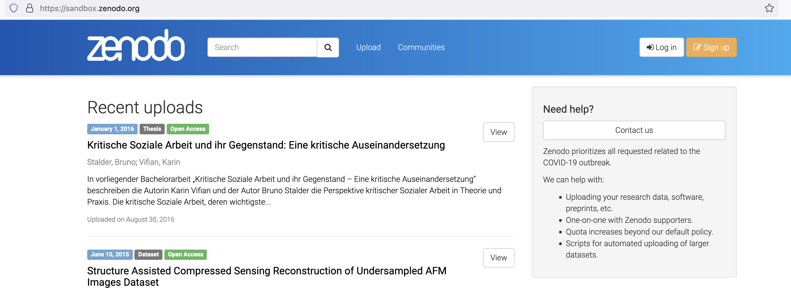

```{r xaringan-themer, include=FALSE, warning=FALSE}
library(xaringanthemer)
library(xaringanExtra)
library(tidyverse)
library(knitr)
library(dygraphs)
library(emo)

# Define pink color
red_pink <- "#e64173"
turquoise <- "#20B2AA"
orange <- "#FFA500"
red <- "#fb6107"
blue <- "#3b3b9a"
green <- "#8bb174"
grey_light <- "grey70"
grey_mid <- "grey50"
grey_dark <- "grey20"
purple <- "#6A5ACD"
slate <- "#314f4f"

xaringanExtra::use_panelset()
xaringanExtra::use_broadcast()
xaringanExtra::use_share_again()
xaringanExtra::style_share_again(share_buttons = c("twitter", "linkedin"))
xaringanExtra::use_tachyons()
xaringanExtra::use_fit_screen()
xaringanExtra::use_tile_view() # O
style_mono_accent(
  base_color = "#56BCD3",
  background_color = "#ffffff",
  inverse_background_color = "#56BCD3",
  header_color = "#56BCD3",
  inverse_header_color = "#ffffff", 
  inverse_text_color = "#ffffff",
  code_inline_color = "#56BCD3",
  link_color= "#56BCD3",
  footnote_color =  "#56BCD3",
  text_font_size = "35px",
  header_font_google = google_font("Times", "Regular", "500"),
  text_font_google   = google_font("Darker Grotesque", "500"),
  code_font_google   = google_font("Fira Mono")
)


require(kableExtra,quietly=TRUE)
require(tidyverse,quietly=TRUE)
require(lubridate,quietly=TRUE)
require(plotly,quietly=TRUE)
require(scales,quietly=TRUE)
require(DeclareDesign)
set.seed(11010)

check <- emo::ji("heavy_check_mark")


# A utility function
png_digraph <- function(filename, code){
  capture.output({
    system(paste("dot -Tpng",code,"-Gdpi=100","-o",filename,sep=" "))
  },  file='NUL')
  knitr::include_graphics(filename)
}

```


class: center, middle, inverse
background-image: url("figs/hca.jpg")
background-position: center
background-size: cover

# Haciendo Ciencia Abierta


## Dia 3
### Ignacio Sarmiento-Barbieri
---

class: middle

### Agenda 

- Hoy: 

- Experimentos y Plan Pre Experimental
    - Cálculos de Poder
    - Ejemplos en `R` con `DeclareDesign`

- OSF  


---

# PAP
  
  - Experimentos: Porqué experimentos?
  
  - Análisis Pre-experimentos
  
     - ¿Qué incluimos?
    
     - ¿Cómo usamos `DeclareDesign`?
     
     - Aplicación: Productos sanitarios
   
     
---
## Asignación aleatoria


- Los experimentos son el "gold standard"
- La .hi-slate[ asignación aleatoria] evita el sesgo de selección


---
# Desarrollo
```{r , echo = FALSE, out.width=700, fig.align='center'}
knitr::include_graphics("figs/baru.png")
```

---
# Desarrollo

- En la etapa de Desarrollo	

- Es clave  calcular el poder estadístico del experimento. 


---
##  Qué es el poder estadístico?

- Queremos separar señal de ruido

- Poder = probabilidad de rechazar la hipótesis nula de que no hay efecto del tratamiento, dado que el efecto verdadero $\ne$ 0.

- En otras palabras, la habilidad de detectar que existe un efecto

- El poder está entre (0, 1).

- Comúnmente el limite que queremos: 0.8 or 0.9.

---
## Punto de partida del análisis de poder 

    
- El análisis de poder es algo que hacemos *antes* de realizar un experimento

     - Nos ayuda a determinar la muestra que necesitamos para detectar un tamaño de efecto determinado.

     - O nos ayuda a descubrir una diferencia mínima detectable dado un tamaño de muestra establecido.

     - Puede tambien ayudarnos a decidir si queremos realizar un estudio.

- Es difícil aprender de un hallazgo nulo con poca potencia.

     - ¿Hubo algún efecto, pero no pudimos detectarlo? o no hubo efecto? No podemos decir nada.    

- Sin embargo, el análisis de poder requiere algunas conjeturas: el investigador debe proporcionar valores de parámetros desconocidos, como por ejemplo el tamaño del ATE real.

---
## Poder

- Digamos que realmente hay un efecto de tratamiento y ejecutamos el experimento muchas veces. ¿Con qué frecuencia obtendremos un resultado estadísticamente significativo?

- Hay que hacer algunas conjeturas

    - Cuán grade es el efecto del tratamiento?

    - Cuantas unidades van a ser tratadas, etc

    - How much noise is there in the measurement of your outcome?


---
## Aproximaciones para cálculos de poder


- Cálculos analíticos


- Simulaciones

---
## Herramientas  para cálculos de poder

- Interactivos

    - [EGAP Power Calculator](https://egap.shinyapps.io/power-app/)

    - [rpsychologist](https://rpsychologist.com/d3/NHST/)

- R Packages

    - [pwr](https://cran.r-project.org/web/packages/pwr/index.html)

    - [DeclareDesign](https://cran.r-project.org/web/packages/DeclareDesign/index.html), see also <https://declaredesign.org/>


---

## Cálculos analíticos
- Formula:

\begin{align*}
  \text{Power} &= \Phi\left(\frac{|\tau| \sqrt{N}}{2\sigma}- \Phi^{-1}(1- \frac{\alpha}{2})\right)
\end{align*}

- Componentes:
  - $\phi$: standard normal CDF es monotonicamente creciente
  - $\tau$: el tamaño del efecto
  - $N$: el tamaño de muestra
  - $\sigma$: el desvio estandard del resultado 
  - $\alpha$: el nivel de significancia (typically 0.05)

---
## Cálculos analíticos

```{r pwrsimp, echo=TRUE, include=TRUE}
# Poder de un estudio con 80 pbservaciones
# efecto de tamaño 0.25
library(pwr)
pwr.t.test(n = 40, d = 0.25, sig.level = 0.05,
           power = NULL, type = c("two.sample"))
```

---
## Limitaciones de los cálculos analíticos

- Solo derivado para algunos estadísticos  (diferencias de medias)

- Hace supuestos específicos sobre el proceso de generación de datos.

- Incompatible con diseños más complejos

---
## Enfoque de simulación

- MIDA y [DeclareDesign](https://declaredesign.org/)

  - Definimos el modelo y creamos el mundo 

  - Definimos la pregunta

  - Definimos la estrategia de datos, asignacion a tratamientos

  - Estimamos los efectos

  - Repetimos


---
# Desarrollo
```{r , echo = FALSE, out.width=700, fig.align='center'}
knitr::include_graphics("figs/baru.png")
```

---
# Desarrollo
```{r , echo = FALSE, out.width=750, out.height=500, fig.align='center'}
knitr::include_graphics("figs/ghana.png")
```

---

# Desarrollo
```{r , echo = FALSE, out.width=700, fig.align='center'}
knitr::include_graphics("figs/thorton.png")
```

---
## Demostración
```{r , echo = FALSE, out.width=700, fig.align='center'}
knitr::include_graphics("figs/baticomputer_meme.jpg")
```


---
class: center, middle

# Datos!

---


# Necesitamos Datos


- Vayan completando la siguiente encuesta  [https://tinyurl.com/etn2me5s](https://tinyurl.com/etn2me5s) 

```{r , echo = FALSE, out.height=300, out.width=300, fig.align='center'}

```


---
# Preservación de datos


.pull-left[- Método antiguo: enviar al journal/revista un archivo ZIP

- Fuente: Tu computador

- Destino: algún lugar de del sitio web del journal]

.pull-right[Preguntas/¿Y si?:

- los datos no están en su computadora portátil?
  - demasiado grande
  - en el servidor
  - una base de datos
- los datos no son tuyos para enviar
  - confidencialidad
  - propiedad
  - otros problemas de licencia
  ]

---
# Meta 1: Elementos: Datos (cuando sea posible)


.pull-left[- Método antiguo: enviar al journal/revista un archivo ZIP

- **Fuente: Tu computador**

- Destino: algún lugar de del sitio web del journal]

.pull-right[ Preguntas/¿Y si?:

- ¿Cómo llegaron los datos a su computadora portátil?
- ¿Cómo se generaron los datos?

Estas son preguntas de **procedencia**.]


---
# Meta 1: Elementos: Datos (cuando sea posible)


.pull-left[- Método antiguo: enviar al journal/revista un archivo ZIP

- Fuente: Tu computador

- **Destino: algún lugar de del sitio web del journal**]

.pull-right[ Preguntas/¿Y si?:

- ¿Está completo el archivo ZIP?
- ¿Están curados (preservados) los contenidos del archivo ZIP?
- ¿Se pueden reutilizar los datos?
- ¿Se pueden atribuir correctamente los datos al creador?
- ¿Se pueden encontrar los datos independientemente del artículo?

Estas son preguntas **FAIR**.]


---
# Principios **FAIR**

```{r , echo = FALSE, out.width=700, fig.align='center'}
knitr::include_graphics("figs/fair-principles.jpg")
```

---
# El punto de los principios **FAIR**


.pull-left["Good data management is not a goal in itself, but rather is the key conduit leading to knowledge discovery and innovation, and to subsequent data and knowledge integration and reuse by the community after the data publication process."
]

.pull-right["FAIR Principles put specific emphasis on enhancing the ability of machines to automatically find and use the data, in addition to supporting its reuse by individuals." 

([Wilkinson et al, 2016](https://doi.org/10.1038/sdata.2016.18))
]


---
# Ciclo de vida de los datos

--
.pull-left[
- No hay mucho consenso
- Puede ser que se **destruyan**
  - Cuál es el valor de los datos?
  - Qién decide este valor?
]
--
.pull-right[
Ciclo de vida propuesto por la industria: 


```{r , echo = FALSE, out.height=400, out.width=400, fig.align='center',warning=FALSE}
png_digraph("figs/cycle0.png","figs/cycle0.gv")
#knitr::include_graphics("figs/cycle0.png")
```
]


---
# Ciclo de vida de los datos

--
.pull-left[
- No hay mucho consenso
- Puede ser que se **destruyan**
- Puede ser que se **re-utilicen**
  
]

--
.pull-right[


```{r cycle1,echo = FALSE, out.height=400, out.width=400, fig.align='center',warning=FALSE}
png_digraph("figs/cycle1.png","figs/cycle1.gv")
# inspired by 
# 

```
]


---
# Ciclo de vida de los datos


.pull-left[
- No hay mucho consenso
- Puede ser que se **destruyan**
- Puede ser que se **re-utilicen**
  - Lo que inicia un nuevo ciclo
  
]


--
.pull-right[

```{r cycle1-2,echo = FALSE, out.height=400, out.width=650, fig.align='center',warning=FALSE}
png_digraph("figs/cycle1-2.png","figs/cycle1-2.gv")
# inspired by 
# 

```
]


---
# Flujos de trabajo modificados

.pull-left[
Consideremos la parte de preservación por separado:
]

.pull-right[
```{r cycle1-archive,echo = FALSE, out.height=400, out.width=450, fig.align='center',warning=FALSE}
png_digraph("figs/cycle2.png","figs/cycle2.gv")
# inspired by 
# 

```

]

---
# Flujos de trabajo modificados

.pull-left[
Guardamos a medida que avanzamos

]

.pull-right[

```{r cycle2-archive,echo = FALSE, out.height=400, out.width=400, fig.align='center',warning=FALSE}
png_digraph("figs/cycle2-2.png","figs/cycle2-2.gv")
# inspired by 
# 

```

]

---
# Flujos de trabajo modificados


- Mejoramos la preservación y la consistencia 

- Podemos compartirlos antes (varios proyectos con los mismos datos)


<center>
```{r cycle3,echo = FALSE, out.height=300, out.width=700, fig.align='center',warning=FALSE}
png_digraph("figs/cycle3.png","figs/cycle3.gv")
# inspired by 
# 

```
</center>


---
# Pero me preocupa la ética de otros:


<div style="text-align: center; font-size: 150%;">
No quiero que me roben la idea!
<br />
<br/>
Entonces, no voy a publicar todavía mis datos!
</div>


---
#  Qué es preservación?


- Preservar != publicar

--

- De hecho, preservar puede significar que no esta accesible a otros!!

--

- Preservar implica que los datos se guarden por los proximos 10 o 1000 años 

--

- Preservación implica tambien la curación: transormar los datos para que la gente pueda acceder a ellos.
  
---
#  Qué es publicación? 


Publication typically involves making information about the data, as well as the data themselves, available to others.

- Publication can initially mean that only **metadata** (information about the data) is published
- In some cases, it may be that **only** metadata is ever published
- But the metadata will point to how to access the data, how long the data will be preserved, and other salient facts


---
# Principios FAIR 


Ser **F**indable:

- F1. **A los (meta)datos se les asigna un identificador globalmente único y eternamente persistente.**
- F2. los datos se describen con metadatos enriquecidos.
- F3. **Los (meta)datos se registran o indexan en un recurso de búsqueda.**
- F4. Los metadatos especifican el identificador de datos. 


---
# Principios FAIR 


Para ser **A**ccesible:

- A1 **(meta)datos** son recuperables por su identificador utilizando un protocolo de comunicaciones estandarizado.
- A2 Los **(meta)datos**  son accesibles, incluso cuando los datos ya no están disponibles.

---
# Principios FAIR 


Para ser **I**nteroperable:

- I1. **(meta)datos utilizan un lenguaje formal, accesible, compartido y ampliamente aplicable para la representación del conocimiento.**
- I2. **Los (meta)datos usan vocabularios que siguen los principios FAIR.**
- I3. Los (meta)datos incluyen referencias cualificadas a otros (meta)datos.

---
# Principios FAIR 


Para ser **R**e-usable:

- R1. Los **meta(datos)** tienen una pluralidad de atributos precisos y relevantes.
- R1.1. Los **(meta)datos** se publican con una licencia de uso de datos clara y accesible.**
- R1.2. Los **(meta)datos** están asociados con su procedencia.
- R1.3. Los **(meta)datos** cumplen con los estándares relevantes


---
# FAIR Metadata

**I**nteroperable: metadatos estructurados sobre los datos

```{r , echo = FALSE, out.height=700, out.width=550, fig.align='center'}
knitr::include_graphics("figs/icpsr-metadata-screenshot.png")
```


---
# FAIR Metadata

**A**ccessible: metadata estructurada 

```{r , echo = FALSE, out.height=700, out.width=600, fig.align='center'}
knitr::include_graphics("figs/icpsr-metadata-screenshot2.png")
```


---
# FAIR Metadata


**F**indable: identificador persistente, indexado


```{r , echo = FALSE, out.height=700, out.width=800, fig.align='center'}
knitr::include_graphics("figs/gds-metadata-screenshot.png")
```


---
# FAIR Metadata 

- Re-usable: si la licencia lo permite
- Acceso tiene condiciones (Pero la información de como poder acceder (=metadata) esta accesible)


```{r , echo = FALSE, out.height=500, out.width=800, fig.align='center'}
knitr::include_graphics("figs/iab-metadata-screenshot2.png")
```


---
# Esto parace super complicado


- ¡Necesito conservar mis datos durante décadas!

- ¿Cómo hago para que Google indexe mis datos?

--

**Algunos Repositorios Confiables**

-  [Dryad Digital Repository](http://datadryad.org/)
-  [figshare](http://figshare.com/)
-  [Harvard Dataverse](https://dataverse.harvard.edu)
-  [ICPSR](https://www.icpsr.umich.edu/icpsrweb/) and [OPENICPSR](https://www.openicpsr.org/openicpsr/)
-  [Open Science Framework](http://osf.io/)
-  [Zenodo](http://zenodo.org/)
  

---
# Cuáles NO son opciones para la preservación


- Github, Gitlab, Bitbucket, etc.

- Dropbox, Box.com, Google Drive, etc.

- Tu pagina personal

- La página de la universidad

---
# Opciones para la preservación


Vamos a usar: el Sandbox de Zenodo

```{r , echo = FALSE, out.width=700, fig.align='center'}

```


---

## Fuente de Datos


- La siguiente encuesta  [https://tinyurl.com/etn2me5s](https://tinyurl.com/etn2me5s) 

```{r , echo = FALSE, out.height=300, out.width=300, fig.align='center'}

```


---
## Demostración
```{r , echo = FALSE, out.width=700, fig.align='center'}
knitr::include_graphics("figs/baticomputer_meme.jpg")
```

---

class: center, middle,


```{r, echo=FALSE, out.width="60%"}
knitr::include_graphics("figs/soda2.gif")
```


