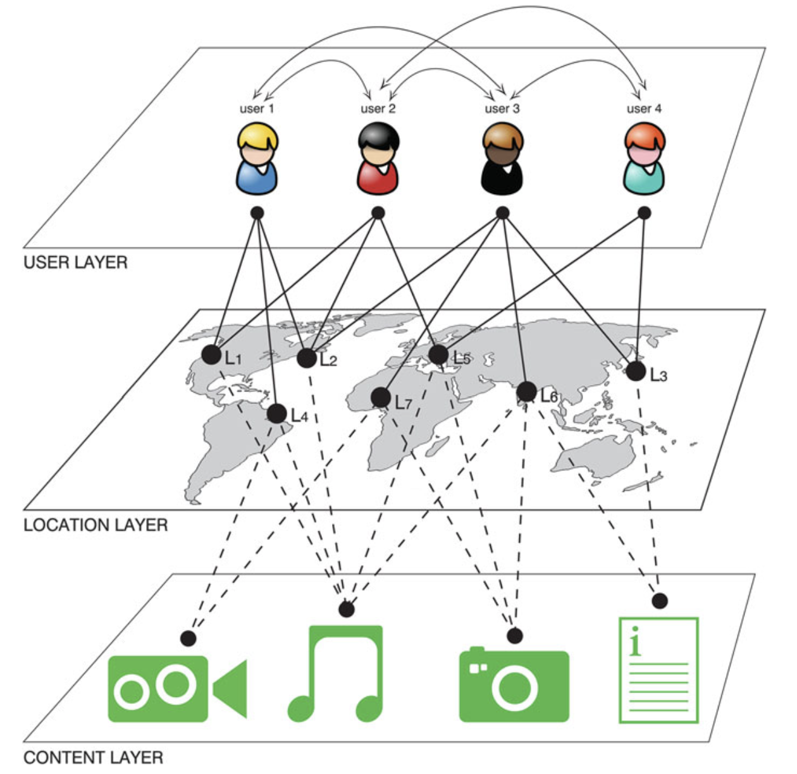
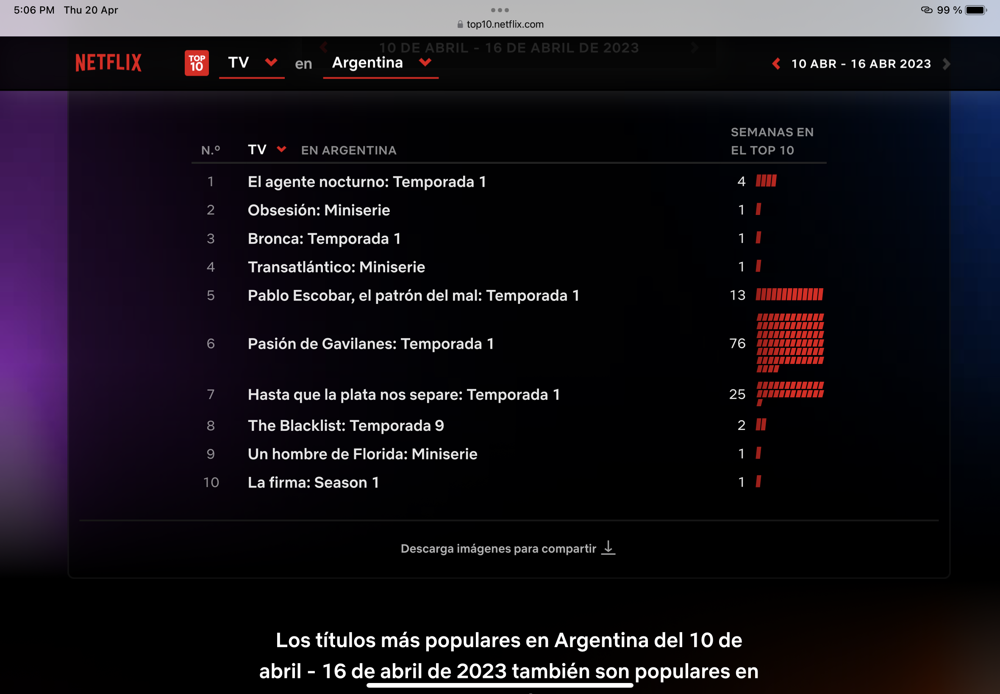
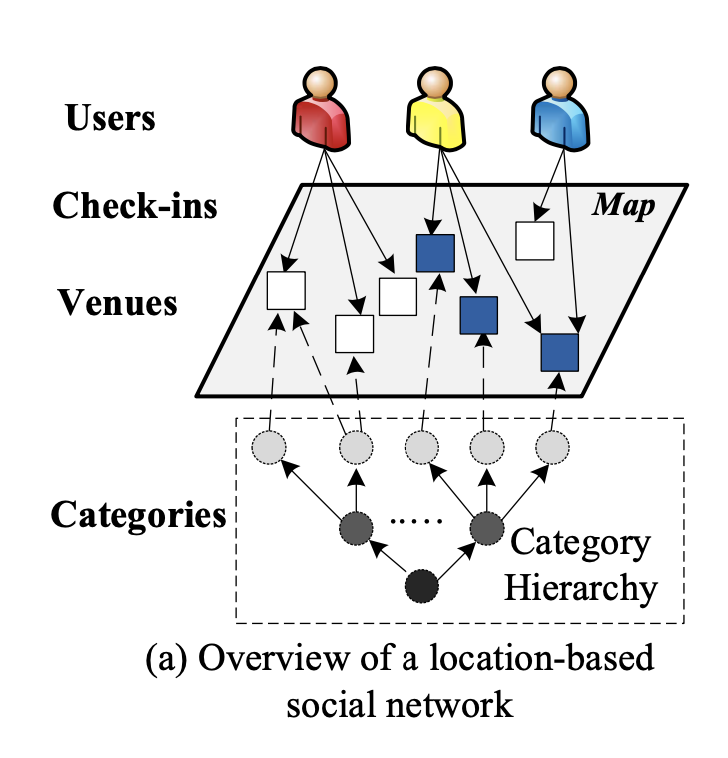
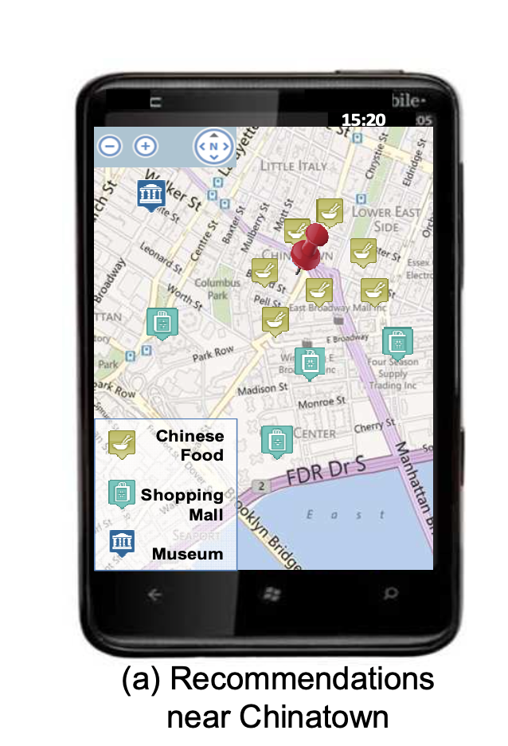
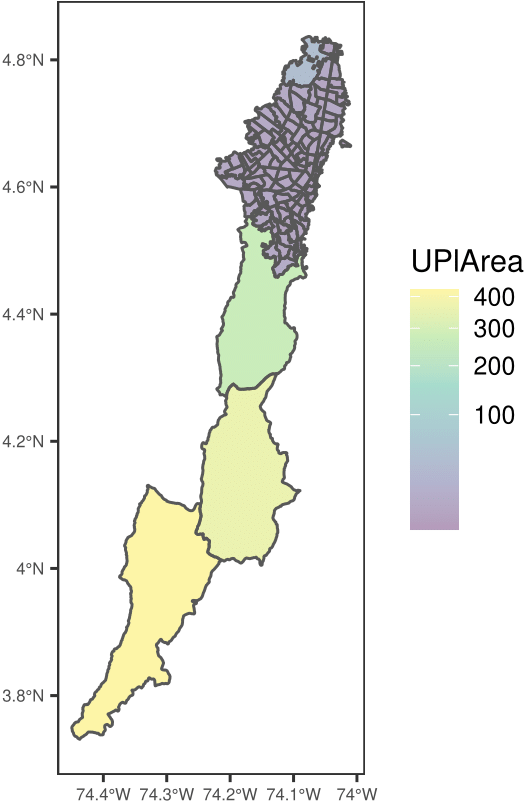
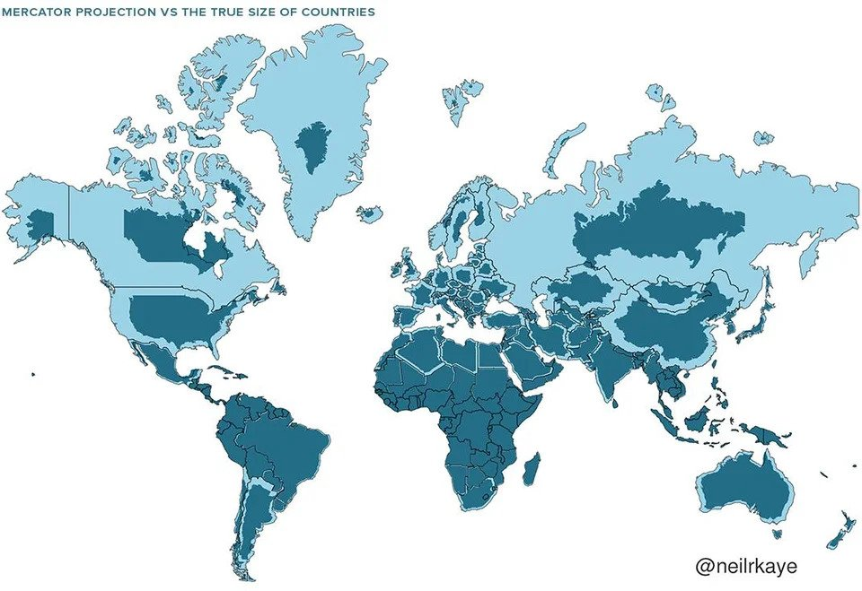
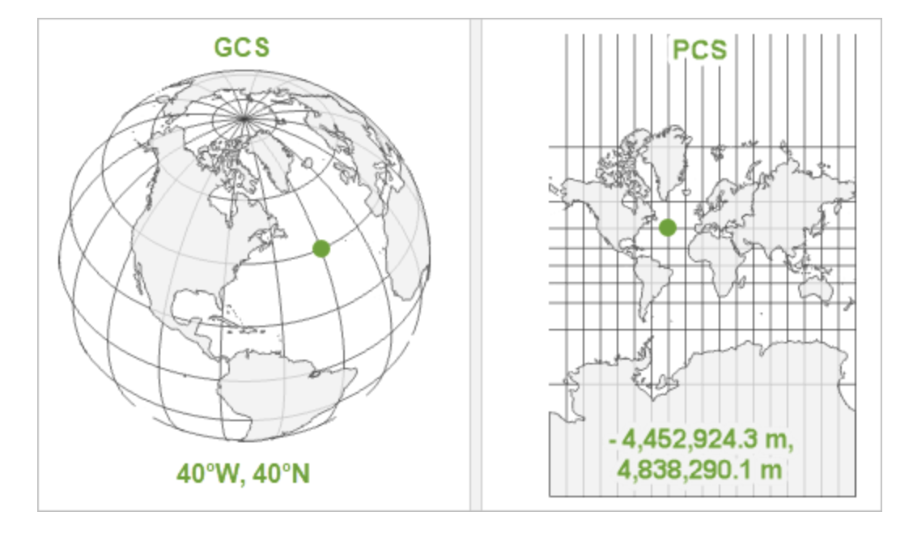

```{r setup, include=FALSE}
options(htmltools.dir.version = FALSE)
```


```{r xaringan-themer, include=FALSE, warning=FALSE}
library(xaringanthemer)
library(xaringanExtra)
library(tidyverse)
library(knitr)
#library(icon)
library(nomnoml)
#library(countdown)
# xaringanExtra::use_logo(
#   image_url = "https://raw.githubusercontent.com/rstudio/hex-stickers/master/PNG/xaringan.png"
# )
xaringanExtra::use_panelset()
xaringanExtra::use_broadcast()
xaringanExtra::use_share_again()
xaringanExtra::style_share_again(share_buttons = c("twitter", "linkedin"))
xaringanExtra::use_tachyons()
xaringanExtra::use_fit_screen()
xaringanExtra::use_tile_view() # O
xaringanExtra::use_scribble()
style_mono_accent(
  base_color = "#3D5A85",
  background_color = "#ffffff",
  inverse_background_color = "#3D5A85",
  header_color = "#3D5A85",
  inverse_header_color = "#ffffff", 
  inverse_text_color = "#ffffff",
  code_inline_color = "#3D5A85",
  link_color= "#3D5A85",
  footnote_color =  "#3D5A85",
  text_font_size = "30px",
  header_font_google = google_font("Times", "Regular", "500"),
  text_font_google   = google_font("Darker Grotesque", "500"),
  code_font_google   = google_font("Fira Mono"),
  code_font_size   = "20px"
)
require(kableExtra,quietly=TRUE)
require(tidyverse,quietly=TRUE)
require(lubridate,quietly=TRUE)
require(plotly,quietly=TRUE)
require(scales,quietly=TRUE)
```


class: center, middle

```{r , echo = FALSE, out.width=900, fig.align='center'}

```

#  Sistemas de Recomendación Basados en Ubicación. 

## Introducción a Datos Espaciales


### Ignacio Sarmiento-Barbieri


---
# Sistemas basados en ubicación. 

```{r , echo = FALSE, out.width=450, fig.align='center'}

```

---
# Sistemas basados en ubicación. 

```{r , echo = FALSE, out.width=700, fig.align='center'}

```

---
# Sistemas basados en ubicación. 

```{r , echo = FALSE, out.width=700, fig.align='center'}

```


---
# Sistemas basados en ubicación. 

```{r , echo = FALSE, out.width=700, fig.align='center'}
knitr::include_graphics("figures/net_col.PNG")
```

---
# Sistemas basados en ubicación. 

```{r , echo = FALSE, out.width=700, fig.align='center'}

```

---
# Sistemas basados en ubicación. 

```{r , echo = FALSE, out.width=700, fig.align='center'}

```

---
# Sistemas basados en ubicación. 

```{r , echo = FALSE, out.width=700, fig.align='center'}

```

---
# Sistemas basados en ubicación. 

.pull-left[
```{r , echo = FALSE, out.width=400, fig.align='center'}
  
```
]

.pull-right[
```{r , echo = FALSE, out.width=300, fig.align='center'}
  
```
]
Fuente: Bao, Zheng & Mokbel (2012)


---
# Datos Espaciales: Tipos

Los datos espaciales vienen en muchas "formas" y "tamaños", los tipos más comunes de datos espaciales son:

- **Punto**

- **Líneas**

- **Polígonos**

- **Grillas (*o raster*)**


---
# Tipos de Datos Espaciales: Puntos


```{r , echo = FALSE, out.height=500,out.width=500, fig.align='center'}
  knitr::include_graphics("figures/albouy_et_al_fig1.png")
```

Fuente: Albouy, Christensen & Sarmiento-Barbieri (2022)


---
# Tipos de Datos Espaciales: Lineas


```{r , echo = FALSE, out.width=500, fig.align='center'}
  knitr::include_graphics("figures/safe_passage.png")
```


---
# Tipos de Datos Espaciales: Poligonos

```{r , echo = FALSE, out.height=450, fig.align='center'}
  
```
  Fuente: https://datosabiertos.bogota.gov.co/dataset/unidad-de-planeamiento-bogota-d-c


---
# Tipos de Datos Espaciales: Combinaciones

.pull-left[
```{r , echo = FALSE, out.width=700, fig.align='center'}
  knitr::include_graphics("figures/ZIP_A.png")
```
]

.pull-right[
```{r , echo = FALSE, out.width=700, fig.align='center'}
  knitr::include_graphics("figures/ZIP_B.png")
```
]
Fuente: Christensen,Sarmiento-Barbieri  & Timmins (2020)


---
#  Tipos de Formatos de Datos Espaciales
## Shapefiles

Archivos Principales

  -  `file.shp`
  -  `file.shx`
  -  `file.dbf`

Archivos secundarios

  -  `file.prj`
  - `file.sbn` , `file.sbx`
  -  `file.shp.xml`
    

---
#  Tipos de Formatos de Datos Espaciales
## GeoJSON


```{r, eval=FALSE}
{
  "type": "Feature",
  "geometry": {
    "type": "Point",
    "coordinates": [-74.066391, 4.601590]
  },
  "properties": {
    "name": "Universidad de Los Andes"
  }
}
```


---
# Proyecciones: La Tierra NO ES PLANA

- El mundo es un elipsoide de forma irregular, pero los dispositivos donde lo representamos son planos

- Pero si queremos mostrarlo en un dispositivo plano, necesitamos una proyección del elipsoide

- La proyección determinará cómo transformar y distorsionar latitudes y longitudes para preservar algunas de las propiedades del mapa: área, forma, distancia, dirección o rumbo.


---
# Proyecciones: La Tierra NO ES PLANA


- Las proyecciones cartográficas intentan representar la superficie de la tierra o una parte de la tierra en una hoja plana de papel o en la pantalla de una computadora.
- Un sistema de referencia de coordenadas (CRS)  define, con la ayuda de coordenadas, cómo el mapa bidimensional proyectado se relaciona con lugares reales de la tierra.

```{r , echo = FALSE, out.width=700, fig.align='center'}
  knitr::include_graphics("figures/world-1.png")
```


---
# Proyecciones: La Tierra NO ES PLANA

- Por ejemplo, los navegantes utilizan la proyección de Mercator donde los meridianos y los paralelos se cruzan siempre en ángulos de 90 grados.
  - Permite ubicarse fácilmente en la línea mostrando la dirección en la que navega
  - Pero la proyección no conserva las distancias.

```{r , echo = FALSE, out.width=800, fig.align='center'}
  knitr::include_graphics("figures/Mercator.png")
```


---
# Proyecciones: La Tierra NO ES PLANA


```{r , echo = FALSE, out.width=700, fig.align='center'}
  
```

---
# Proyecciones: La Tierra NO ES PLANA


```{r , echo = FALSE, out.width=700, fig.align='center'}
  knitr::include_graphics("figures/Mexico_Greenland.gif")
```


---
# Qué projección debería elegir?

- "There exist no all-purpose projections, all involve distortion when far from the center of the specified frame" (Bivand, Pebesma, and Gómez-Rubio 2013)


- La decisión de qué  sistema de referencia de coordenadas (CRS) usar depende  del área en la que desea trabajar, del análisis que desea realizar y, a menudo, de la disponibilidad de datos.

- En algunos casos, no es algo que seamos libres de decidir: "often the choice of projection is made by a public mapping agency" (Bivand, Pebesma, and Gómez-Rubio 2013).

   - Esto significa que cuando se trabaja con fuentes de datos locales, probablemente sea preferible trabajar con el CRS en el que se proporcionaron los datos.
   
---
# Coordinate Reference System (CRS) 

- Con la ayuda de los sistemas de referencia de coordenadas (CRS), todos los lugares de la tierra se pueden especificar mediante coordenadas.


```{r , echo = FALSE, out.width=700, fig.align='center'}
  
```
Fuente: https://www.geoawesomeness.com/all-map-projections-in-compared-and-visualized


---
# Coordinate Reference System (CRS) 


- *Sistemas de coordenadas geográficas*: sistemas de coordenadas que abarcan todo el mundo (por ejemplo, latitud/longitud).
 
     - WGS84 es el CRS más común del mundo, código EPSG: 4326.
    
     - Para Bogotá el IGAC impulsa la adopción de MAGNA-SIRGAS.
   
- *Sistemas de coordenadas proyectadas*: sistemas de coordenadas que se localizan para minimizar la distorsión visual en una región particular (por ejemplo, Robinson, UTM, State Plane)

- Todos los CRS tienen un código [EPSG](https://epsg.org/home.html), que es una colección de definiciones de sistemas de referencia de coordenadas y transformaciones de coordenadas que pueden ser de aplicación global, regional, nacional o local.

---
class: center, middle

#  Break y volvemos con Python

