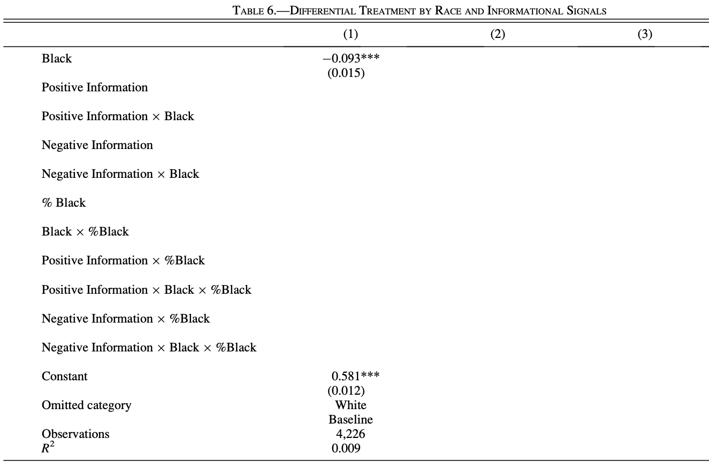
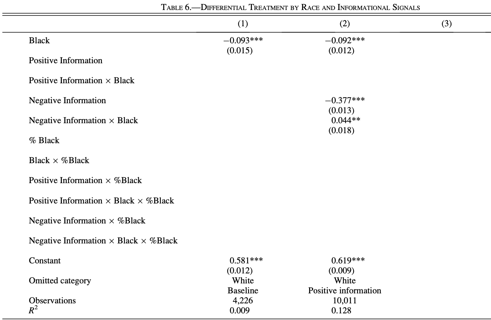
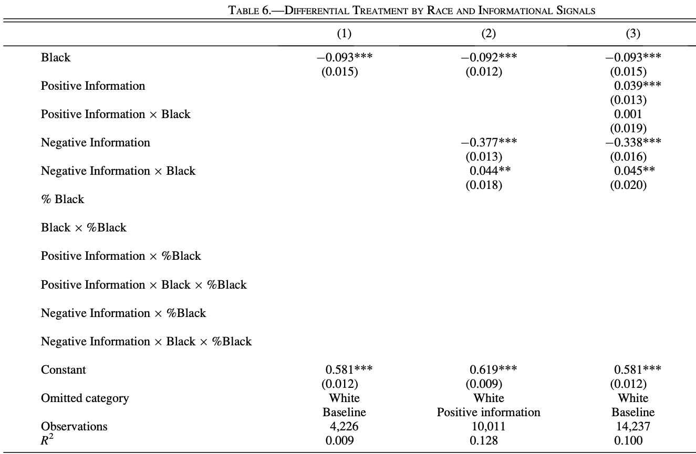

```{r setup, include=FALSE}
options(htmltools.dir.version = FALSE)
```


```{r xaringan-themer, include=FALSE, warning=FALSE}
library(xaringanthemer)
library(xaringanExtra)
library(tidyverse)
library(knitr)
#library(icon)
library(nomnoml)
#library(countdown)
# xaringanExtra::use_logo(
#   image_url = "https://raw.githubusercontent.com/rstudio/hex-stickers/master/PNG/xaringan.png"
# )
xaringanExtra::use_panelset()
xaringanExtra::use_broadcast()
xaringanExtra::use_share_again()
xaringanExtra::style_share_again(share_buttons = c("twitter", "linkedin"))
xaringanExtra::use_tachyons()
xaringanExtra::use_fit_screen()
xaringanExtra::use_tile_view() # O
style_mono_accent(
  base_color = "#af2433",
  background_color = "#ffffff",
  inverse_background_color = "#af2433",
  header_color = "#af2433",
  inverse_header_color = "#ffffff", 
  inverse_text_color = "#ffffff",
  code_inline_color = "#af2433",
  link_color= "#af2433",
  footnote_color =  "#af2433",
  text_font_size = "35px",
  header_font_google = google_font("Times", "Regular", "500"),
  text_font_google   = google_font("Darker Grotesque", "500"),
  code_font_google   = google_font("Fira Mono")
)

require(kableExtra,quietly=TRUE)
require(tidyverse,quietly=TRUE)
require(lubridate,quietly=TRUE)
require(plotly,quietly=TRUE)
require(scales,quietly=TRUE)
```


class: center, middle


# Diseño de Experimentos


## Urban Economics
### Ignacio Sarmiento-Barbieri
---

class: middle

### Agenda 

- Hoy: 
  
  - El marco MIDA en `R`
  
  - Ewens Example
  

---

# Diseño de experimentos

  - El momento de escribir un plan de preanálisis suele ser la primera vez que pensamos en el diseño en su totalidad.
     
  - Hacer el cambio de "buena idea" a "diseño real" significa ser específico
     
  - Este es el momento de participar en la declaración de diseño


---
# MIDA

```{r , echo = FALSE,  out.height=500, fig.align='center'}
knitr::include_graphics("figs/mida_fig.png")
```


---
# MIDA: Cuatro elementos de cualquier diseño de investigación.

  - Modelo: conjunto de modelos de qué causa qué y cómo
  
  - Pregunta: una pregunta formulada en términos del modelo.
  
  - Estrategia de datos: el conjunto de procedimientos que utilizamos para recopilar información del mundo (muestreo, asignación, medición)
     
  - Estrategia de respuesta: cómo resumimos los datos producidos por la estrategia de datos


---
# Ejemplo 1: Estimar la edad promedio de los ciudadanos de un pequeño pueblo de Italia

  - Modelo:  todos los ciudadanos de la pequeña aldea tienen edades, 
  
  - Pregunta: Promedio de la edad. 
  
  - Estrategia de datos: tomamos una muestra aleatoria de tres ciudadanos cuyas edades luego se miden a través de una encuesta . 
  
  - Estrategia de respuesta: Estimador de la media de la muestra

---
# Ejemplo 1: Estimar la edad promedio de los ciudadanos de un pequeño pueblo de Italia

```{r echo=TRUE, fig.align='center', message=FALSE, warning=FALSE, cache=TRUE}
require(DeclareDesign)

n_samp<-3
mod_edad <-
  declare_model(N = 100, age = sample(0:80, size = N, replace = TRUE)) +
  declare_inquiry(mean_age = mean(age)) +
  declare_sampling(S = complete_rs(N = N, n = n_samp)) +
  declare_estimator(age ~ 1, model = lm_robust) 
```  

---
# Ejemplo 1: Estimar la edad promedio de los ciudadanos de un pequeño pueblo de Italia

```{r, echo=FALSE, fig.align='center', message=FALSE, warning=FALSE, out.width=1000, cache=TRUE}
diagnosistico <- diagnose_design(mod_edad)
```

```{r, echo=FALSE, fig.align='center', message=FALSE, warning=FALSE, out.width=1000}
#head(diagnosistico$simulations_df)

h1<-ggplot(diagnosistico$simulations_df, aes(x=estimate)) +
  geom_histogram(fill="#af2433") +
    geom_vline(xintercept=mean(diagnosistico$simulations_df$estimand),lty='solid') +
  geom_vline(xintercept=mean(diagnosistico$simulations_df$estimate),lty='dashed') +
  theme_bw()

ggplotly(h1)
```

---
# Ejemplo 1: Estimar la edad promedio de los ciudadanos de un pequeño pueblo de Italia

```{r, echo=TRUE, fig.align='center', message=FALSE, warning=FALSE, out.width=300}
head(diagnosistico$simulations_df) %>% 
  kbl() %>%
   kable_classic(full_width = F, html_font = "Cambria", font_size = 20)
```


---
# Ejemplo 1: Estimar la edad promedio de los ciudadanos de un pequeño pueblo de Italia

```{r, echo=TRUE, fig.align='center', message=FALSE, warning=FALSE, out.width=300, cache=TRUE}
diagnosands <- declare_diagnosands(power = mean(p.value <= 0.05))

diagnosis <- 
  diagnose_design(mod_edad, diagnosands = diagnosands)

diagnosis$diagnosands_df %>% 
  kbl() %>%
   kable_classic(full_width = F, html_font = "Cambria", font_size = 20)
```

---
# Ejemplo 1: Estimar la edad promedio de los ciudadanos de un pequeño pueblo de Italia


```{r}
red_mod_edad<-mod_edad %>% 
redesign(n_samp = c(4,5,6,8,10)) %>%
  diagnose_designs()

red_mod_edad$diagnosands_df %>% 
  kbl() %>%
   kable_classic(full_width = F, html_font = "Cambria", font_size = 20)

```
---
# Ejemplo 2: Sorpresa de Octubre

```{r , echo = FALSE, out.width=700, fig.align='center'}
knitr::include_graphics("figs/october-surprise.jpg")
```

---
# Ejemplo 2: Sorpresa de Octubre
```{r oct, echo=FALSE, fig.align='center', message=FALSE, warning=FALSE, out.width=1000, cache=TRUE}

dta<-read.csv("president_general_polls_2016.csv")
dta<-  dta %>% mutate(startdate=lubridate::mdy(startdate),
                       enddate=lubridate::mdy(enddate)
 )
dta2<-dta %>% filter(enddate>=lubridate::mdy("01/01/2016")) %>% select(pollster,startdate,enddate,adjpoll_clinton,adjpoll_trump)

dta2<- dta2 %>% pivot_longer(cols=adjpoll_clinton:adjpoll_trump, names_to="Candidato",values_to="adj_poll")

dta2 <- dta2 %>% mutate(Candidato=ifelse(Candidato=="adjpoll_clinton","Clinton","Trump"))


dta2$month <- as.Date(cut(dta2$enddate,
                          breaks = "month"))
dta2$Candidato <- as.factor(dta2$Candidato)

p1<-ggplot(data = dta2 %>% filter(enddate<=lubridate::mdy("08/01/2016"))) + 
  geom_smooth(aes(x=month, y = adj_poll, color = Candidato, group=Candidato),method="lm",formula=y~poly(x,1)) + 
  scale_color_manual(values=c("blue", "red")) +
  scale_x_date(labels = date_format("%Y-%m"),
               date_breaks = "1 month")  + # custom x-axis labels
  labs(x = "Mes", y = "Resultado Encuestas (%)") +
  theme_bw()


ggplotly(p1)

```

---
# Ejemplo 2: Sorpresa de Octubre
```{r , echo = FALSE, out.height=500, fig.align='center'}
knitr::include_graphics("figs/trump_surprise.jpg")
```

---
# Ejemplo 2: Sorpresa de Octubre

```{r oct2, echo=FALSE, fig.align = 'center', message=FALSE, warning=FALSE, out.width=1000}
p2<-ggplot(data = dta2 %>% filter(enddate<=lubridate::mdy("09/01/2016"))) + 
  geom_smooth(aes(x=month, y = adj_poll, color = Candidato),method="lm",formula=y~poly(x,1)) + 
  scale_color_manual(values=c("blue", "red")) +
  scale_x_date(labels = date_format("%Y-%m"),
               date_breaks = "1 month")  + # custom x-axis labels
  labs(x = "Mes", y = "Resultado Encuestas (%)") +
  theme_bw()


ggplotly(p2)
```
---

# Ewens (2014)

    

  - Test: taste based vs statistical discrimination
  
  - Use vacancy listings on Craigslist.org, across 34 U.S. cities, 
  
  - They sent inquiry e-mails  to 14,000 landlords. 
  
  - E-mails have information about the applicants: positive, negative, and no signals beyond race. 
  
    - In the no-signal inquiry, landlords receive e-mails with racial-sounding names as the only signal. 
    - In the positive information inquiry, the fictional applicant informs the landlord that she is a nonsmoker with a respectable job. 
    - In the negative information inquiry, the applicant tells the landlord she has a below-average credit rating and smokes. 


---

# Ewens (2014) Hipothesis

H1 Stat: On average, a white applicant is more likely to receive a positive response than a black applicant in the no-signal base case

H1 Taste: On average, a white applicant is more likely to receive a positive response than a black applicant in the no-signal base case.

$$
R_i = \alpha_W + \alpha_B B_i + u_i
$$

---
# Ewens (2014) Hipothesis

```{r , echo = FALSE, out.width=800, fig.align='center'}

```

---
# Ewens (2014) Hipothesis

H2 Stat: On average, the positive response gap between white and black applicants is larger with a positive signal sent than with a negative signal sent.

H2 Taste: On average, the response gap between white and black applicants when a positive signal is sent is larger than the response gap between white and black applicants when a negative signal is sent.

\begin{align}
R_i = \alpha_{PW} + \alpha_{PB} B_i   + \alpha_{NW} N_i  + \alpha_{NB} (N_i \times B_i)+ u_i
\end{align}


---
# Ewens (2014) Hipothesis

```{r , echo = FALSE, out.width=800, fig.align='center'}

```

---
# Ewens (2014) Hipothesis

H3 Stat: On average, negative information will shrink the racial gap observed in the base case, but positive information will have an ambiguous effect on the racial gap observed in the base case.

H3 Taste: On average, negative information will unambiguously narrow the racial gap observed in the no-signal base case, but positive information will unambiguously widen the racial gap observed in the base case.


\begin{align}
R_i = \beta_{W} + \beta_{B} B_i  + \beta_{P} P_i + \beta_{PB} (P_i \times	B_I)   + \beta_{NW} N_i  + \beta_{NB} (N_i \times B_i)+ u_i
\end{align}

---
# Ewens (2014) Hipothesis

```{r , echo = FALSE, out.width=800, fig.align='center'}

```
---

```{r info}
#sessionInfo()
```

